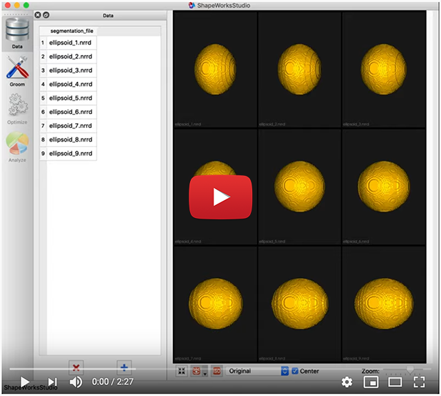

# ShapeWorks Interfaces


ShapeWorks tools are designed to support different usage scenarios, including execution on a local computing platform through terminal ([command line](#shapeworks-commands)) and the user-friendly [Studio](#shapeworksstudio) application, APIs including [Python](#shapeworks-in-python), and remote systems such as private or public [clouds](#shapeworks-in-the-cloud). 


## ShapeWorks Commands


ShapeWorks consists of a set of independent command line tools for preprocessing binary segmentations and surface meshes ([Groom](../workflow/groom.md)) and computing landmark-based shape models ([Optimize](../workflow/optimize.md)). It also includes an interactive user interface called [ShapeWorksStudio](#shapeworksstudio) to analyze and visualize the optimized shape models ([Analyze](../workflow/analyze.md)). 

We are consolidating these tools into a single, reusable API that is shared across different computational libraries in ShapeWorks, and a standalone `shapeworks` command. 

The `shapeworks` executable is highly flexible, modular, and loosely coupled, with standardized subcommands and interactive help to perform individual operations needed for a typical shape modeling workflow that includes the Groom, Optimize, and Analyze phases. Please see [shapeworks commands documentation](../tools/ShapeWorksCommands.md) for the list of available commands.


:fa-info-circle: _**Important:**_  Each time you use ShapeWorks from the command line, you must first activate its environment:
```
$ conda activate shapeworks
```

## ShapeWorks in Python

**Coming soon!**  We are developing Python bindings to enable users to script their customized shape modeling workflows. Exemplar [use cases](../use-cases/use-cases.md) will be updated to use these Python APIs to showcase their use and flexibility.


## ShapeWorksStudio


ShapeWorksStudio is a cross-platform graphical user interface (GUI) to support the standard shape analysis workflow needed by most ShapeWorks users, enabling a wide variety of research scenarios. It is currently supporting image-based grooming and is actively under developement to support surface meshes, more sophisticated grooming operations (including user annotations) and offline processing.  ShapeWorksStudio enable real-time parameter tuning and visualization of the optimization process, and statistical analyses.


[](https://youtu.be/RX4uSB_ot3U "ShapeWorksStudio - Click to Watch!")

## ShapeWorks in the Cloud 

*Work in progress ... Stay tuned!*


