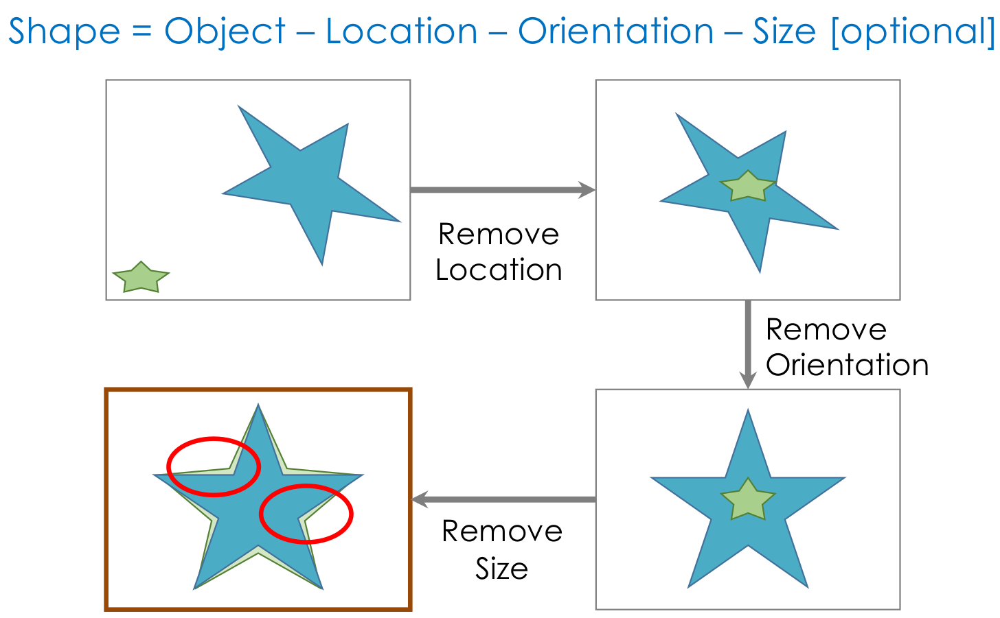
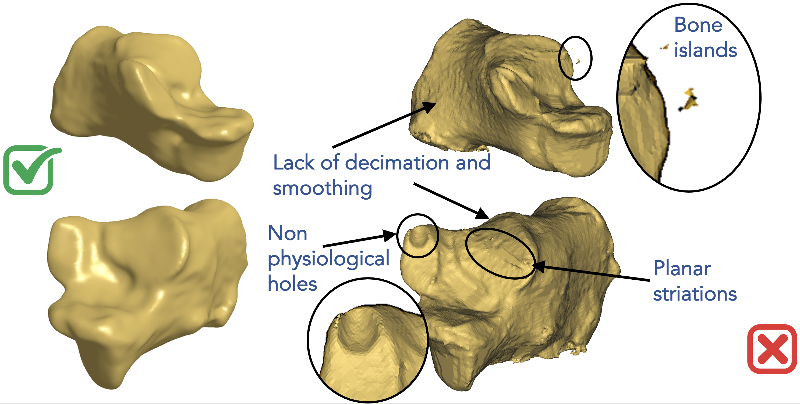
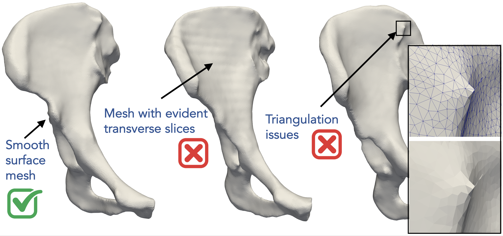

# Shapes, What & From Where?

## What is Shape?

The shape is the characteristic that remains after removing all global geometrical information from an object. To study shape, we would like to study the differences among these characteristics in populations of objects belonging to the same class.

## Where Shapes Come From? 

In medical imaging, shapes can be obtained from images of anatomies (e.g., CTs and MRIs), where anatomies of interest can be manually or semi-automatically segmented/delineated. Other applications could entail modeling geometries using computer-aided design systems, or acquiring real-world objects through sampling (2D via image acquisition devices, 3D via laser scanners).

Here are some examples of free software packages that include enable both manual and semi-automated anatomy segmentation:

- [Seg3D](https://www.sci.utah.edu/software/seg3d.html)
- [ITK-SNAP](http://www.itksnap.org)
- [3DSlicer](https://www.slicer.org)

## What surfaces are ”good” for shape modeling?

The results from the segmentation process are often not directly usable for shape modeling tools. Let’s go over some examples of good and bad segmentation results for shape modeling.

Here is an example of a poor segmentation for the calcaneus on the right of the below figure. Segmentation methods, especially those that rely on intensity thresholding, can easily result in bone islands. Segmented anatomies can have rough surfaces and aliasing artifacts due to intensity noise and limitations on voxel spacing. Planar striations and non-physiological bone holes can result due to imaging artifacts. All these types of artifacts are not anatomically relevant and should not be captured when we study the statistics of shapes. This is in comparison to a smoothed and decimated segmentation on the left of the below figure where we can see relevant morphological features to be studied.

Below on the right is an example of a scapula segmentation where limitations in voxel spacing, noisy image intensities, and patient positioning in the scanner can result in stair-step features, irrelevant bone protrusions, and non-anatomical holes in thin structures. These types of artifacts negatively affect the integrity of the underlying geometry, however, they can be fixed by some data preprocessing steps before feeding the surfaces to shape modeling. On the left is the same scapula after hole filing and surface smoothing.

Below are another examples of bad surfaces for shape modeling where the surface meshing step can  produce some connectivity artifacts such as non-watertight meshes. A surface mesh could also have evident transverse slices due to voxel spacing and patient positioning resulting in some ringing artifacts on the surface. A smooth surface mesh like that one on the left is the best fit for shape modeling and analysis.

!!! danger "Data preparation and quality control is the first step!"    
    For shape modeling purposes, it is recommended that we quality control segmentation results before feeding them to the shape modeling process. Most of these surface integrity issues can be resolved by some data preprocessing step, which is the [groom stage](../workflow/groom.md) in a typical [shape modeling workflow](../getting-started/workflow.md). 

## What is Shape Modeling?

Let’s first consider parameterized geometric shapes. For example, disregarding location, orientiation, and global scale, an ellipse can be fully described by its major and minor radii. A torus can be parameterized by it s inner and outer radii.

Here is a more complex example of parameterized shapes called *supershapes*, which be used to describe many complex shapes and curves that are found in nature. On the left, you can see sliders that control shape parameters describing a supershape. Every time we change any of these parameters, we get a different shape that belongs to the supershapes family. Hence, these parameters fully describe a shape in this family or population. This video was captured using [Andrew Marsh's](http://andrewmarsh.com/apps/releases/supershapes.html) app website for supershapes generation.

<video src="https://sci.utah.edu/~shapeworks/doc-resources/mp4s/supershapes-gen.mp4" autoplay muted loop controls style="width:100%">

But, how about anatomies that one would want to study? Most real-world objects have a characteristic shape relative to other objects, and anatomy is no exception. Across a population, instances vary in shape, while retaining the “key features” of the shape, so shape varies statistically. So how can we quantitatively describe a subject’s anatomy within a population? and capture such statistical variations? 
    
Or in other words: 
- How can we define these sliders or knobs for a given anatomical population? What does each knob represent?
- How many knobs or shape parameters are significant to describe an anatomy of interest?
- How can we rank these shape parameters based on their significance?

*Answering the above questions for the anatomical population at hand is the crux of shape modeling.* 

!!! note "Shape modeling is about learning population-specific parameterization"
    Shape modeling is the process of discovering significant shape parameters directly from medical data that can fully describe an anatomy in the context of a population.
    

