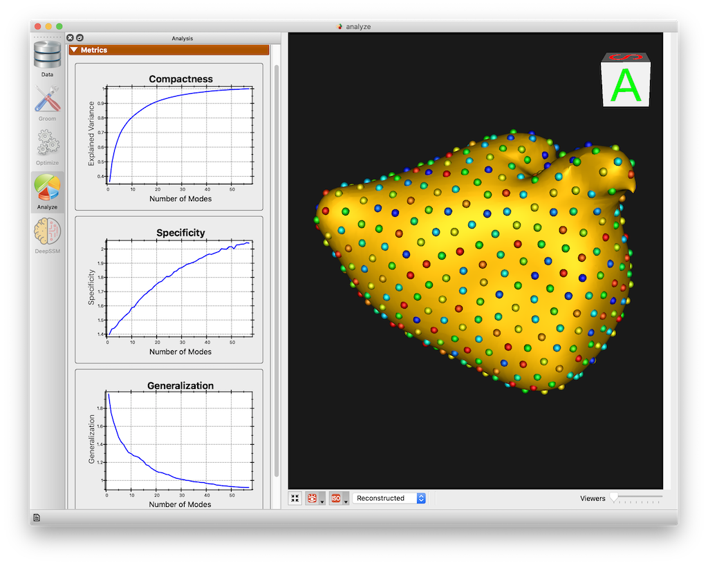

# ShapeWorks Studio Analyze Module

After optimization is complete, you may analyze the data in Studio using the Analysis module.  There are several panels available in the Analysis Module.

## View Panel

The View panel contains all of the options for controlling the analyis viewer options.

### Group

The Group mode allows for group comparison to quantify and visualize population-level differences.  Each `group_<value>` column from the project can be selected and the differences between any two values (i.e., group identifiers) in the groups can be displayed by selecting the group values in the left and right dropdown boxes.  A group difference display showing vectors and a colormap of distance can be shown using the "Diff -->" button.

### Samples

The Samples tab of the view panel allows you to view all of the samples in your cohort, view a single sample by index, or view the median sample.

### PCA

The PCA tab of the View panel shows reconstructed shapes (surface meshes) along PCA modes of variation. Modes of variations are shape parameters learned/discovered from your data that describes shape variations. You can control the location along the PCA mode with the Standard Deviation slider.  The extent of this slider is configurable in [Preferences](#preferences).  Values displayed:

`Lambda` - This shows the PCA loading of current position of the slider.  The middle of the slider, at the mean value, will be 0.  The extent of lambda is defined by the number of standard deviations of the slider as described above.  At standard deviation of 1.0, it will be the square root of the mode's eigenvalue.

`Eigenvalue` - This shows the eigenvalue of the currently selected mode.  This is a unitless measure of how much variance is explained by this mode.  The modes are sorted in decreasing order of eigenvalue, corresponding to the most variance explained first.

## Metrics Panel

The Metrics panel shows the Compactness, Specificity, and Generalization charts.  These are interactive charts with hover menus and the ability to zoom, pan, etc.

See [Shape Model Evaluation](../new/ssm-eval.md) for more information about shape evaluation.

## Surface Reconstruction Panel

The surface reconstruction panel provides options for the surface reconstruction method.  There are three surface reconstruction methods available depending on the data you supply.

`Legacy` - If an older XML file with only particle files is supplied, then only this option is available.  This is the fallback option since it requires only the particles.

`Mesh Warping Based` - Mesh warping based method that utilizes the mean mesh.  You must have either meshes supplied or image based (distance transforms).

`Distance Transform Based` - Surface reconstruction based on distance transforms.  Project must have distance transforms.

Below is an example of the difference in using this option.

