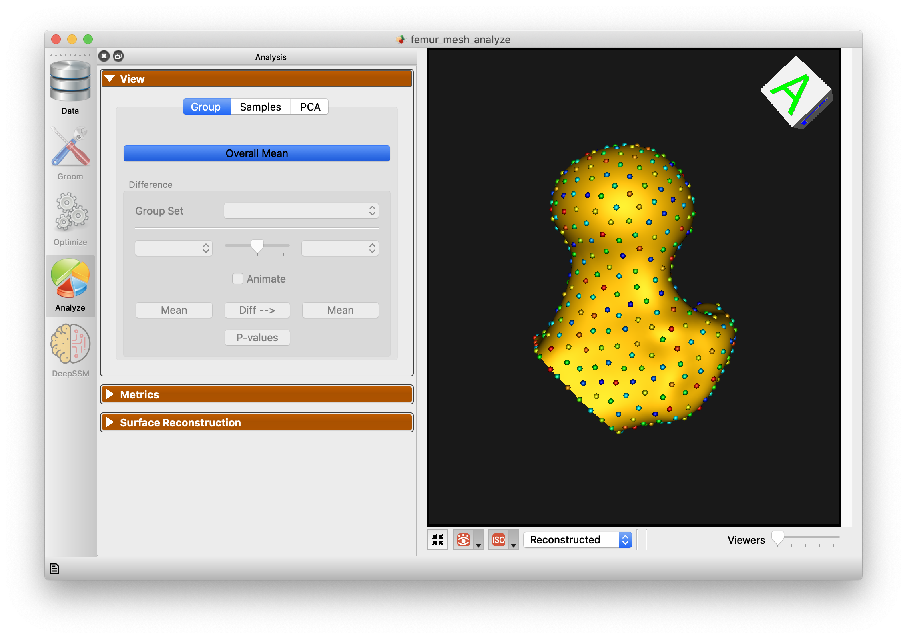

# Femur-Mesh: Shape Model directly from Mesh

## What and Where is the Use Case?

This use case demonstrates using ShapeWorks tools to perform the following.

- Build a shape model where shapes are given as triangular surface meshes
- Groom a dataset from meshes, and obtain a SSM without converting the meshes to a different representation. This requires significantly lower RAM.

The use case is located at: `Examples/Python/femur_mesh.py`


 
## Running the Use Case

To run the use case, run `RunUseCase.py` (in `Examples/Python/`).

```
$ cd /path/to/shapeworks/Examples/Python
$ python RunUseCase.py femur_mesh
```

This calls `femur_mesh.py` (in `Examples/Python/`) to perform the following.
            
* Loads the femur dataset using a local version if it exists (i.e., previously downloaded); otherwise, the dataset is automatically downloaded from the [ShapeWorks Data Portal](http://cibc1.sci.utah.edu:8080/).
* Optimizes particle distribution (i.e., the shape/correspondence model) by calling optimization functions in `OptimizeUtils.py` (in `Examples/Python/`). See [Optimizing Shape Model](#optimizing-shape-model) for details about algorithmic parameters for optimizing the shape model.
* Launches ShapeWorks Studio to visualize the use case results (i.e., the optimized shape model and the groomed data) by calling functions in `AnalyzeUtils.py` (in `Examples/Python/`).

## Grooming Data

In this use case, we download pre-groomed data. The use case will be updated soon to demonstrate the full mesh grooming process.

## Optimizing Shape Model

Below are the default optimization parameters when running this use case. For a description of the optimize tool and its algorithmic parameters, see: [How to Optimize Your Shape Model](../workflow/optimize.md).

```bash
$ python RunUseCase.py femur_mesh
```

```python
{
        "number_of_particles": 1024,
        "use_shape_statistics_after": 0,
        "use_normals": 0,
        "normal_weight": 0.0,
        "checkpointing_interval" : 10000,
        "keep_checkpoints" : 0,
        "iterations_per_split" : 4000,
        "optimization_iterations" : 500,
        "starting_regularization" : 10,
        "ending_regularization" : 1,
        "recompute_regularization_interval" : 1,
        "domains_per_shape" : 1,
        "domain_type" : 'mesh',
        "relative_weighting" : 10,
        "initial_relative_weighting" : 1,
        "procrustes_interval" : 1,
        "procrustes_scaling" : 1,
        "save_init_splits" : 0,
        "verbosity" : 2,
}
```

## Analyzing Shape Model

ShapeWorks Studio visualizes/analyzes the optimized particle-based shape model by visualizing the mean shape, individual shape samples, and the shape modes of variations. For more information, see: [How to Analyze Your Shape Model?](../workflow/analyze.md).            

Here is the mean shape of the optimized shape mode using single-scale optimization.



Here are femur samples with their optimized correspondences.


Here is a video showing the shape modes of variation (computed using principal component analysis - PCA) of the femur dataset using single-scale optimization.

<p><video src="https://sci.utah.edu/~shapeworks/doc-resources/mp4s/femur_mesh_pca.mp4" autoplay muted loop controls style="width:100%"></p>
