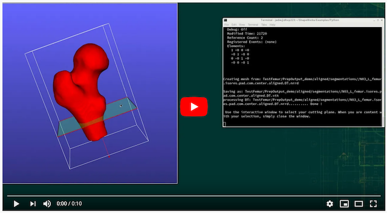
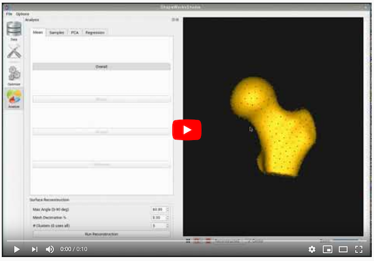
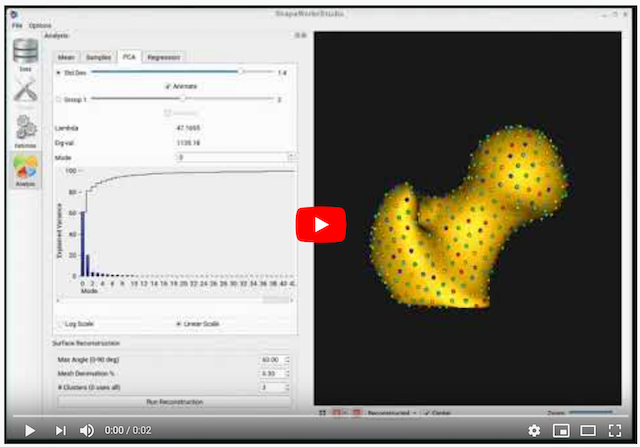

# Femur: Shape Model from Meshes

## What and Where is the Use Case?

This use case demonstrates using ShapeWorks tools to perform the following.

- Build a shape model where shapes are given as triangular surface meshes
- Groom a dataset that contains both shapes (meshes) and their corresponding imaging data (e.g., CT)
- Interactive cutting plane selection for data grooming

The femur meshes in this data set have been segmented with various shaft lengths, as can be seen below. To remove this variability so that it is not captured in the shape model, the femurs are clipped using a cutting plane. The use case has a predefined cutting plane, but you can choose to overwrite it and define the cutting plane interactively by running the use case with the `--interactive` tag. There are two ways to define the cutting plane interactively, as explained below.


The use case is located at: [Examples/Python/femur.py](https://github.com/SCIInstitute/ShapeWorks/tree/master/Examples/Python/femur.py)
 
## Running the Use Case

:fa-info-circle: _**Important:**_ Minimum of 32GB of RAM required to run the full use case.

To run the use case, run [RunUseCase.py](https://github.com/SCIInstitute/ShapeWorks/tree/master/Examples/Python/RunUseCase.py) with proper tags. The tags control the type of input data and the optimization method. See [Getting Started with Use Cases](../use-cases/use-cases.md#running-use-case) for the full list of tags.

* `--start_with_prepped_data`: to run the optimization on previously processed/groomed data.
* `--interactive`: This tag is used to allow you to interactively select the cutting plane to be used for clipping all meshes. If this tag is not used, the pre-defined cutting plane is used to clip the given meshes.


To run the full pipeline with multi-scale and the predefined cutting plane:
            
```
$ cd /path/to/shapeworks/Examples/Python
$ python RunUseCase.py --use_case femur 
```

This calls [femur.py](https://github.com/SCIInstitute/ShapeWorks/tree/master/Examples/Python/femur.py) to perform the following.
            
* Loads the femur dataset using a local version if it exists (i.e., previously downloaded); otherwise, the dataset is automatically downloaded from the [ShapeWorks Data Portal](http://cibc1.sci.utah.edu:8080/).
* Grooms the images and meshes by calling data preprocessing functions in [GroomUtils.py](https://github.com/SCIInstitute/ShapeWorks/tree/master/Examples/Python/GroomUtils.py). See [Grooming Data](#grooming-data) for details about these preprocessing steps.
* Optimizes particle distribution (i.e., the shape/correspondence model) by calling optimization functions in [OptimizeUtils.py](https://github.com/SCIInstitute/ShapeWorks/tree/master/Examples/Python/OptimizeUtils.py). See [Optimizing Shape Model](#optimizing-shape-model) for details about algorithmic parameters for optimizing the shape model.
* Launches ShapeWorksStudio to visualize the use case results (i.e., the optimized shape model and the groomed data) by calling functions in [AnalyzeUtils.py](https://github.com/SCIInstitute/ShapeWorks/tree/master/Examples/Python/AnalyzeUtils.py)


### Running with Interactivity

To run the use case interactively, run:

```            
$ python RunUseCase.py --use_case femur --interactive
```

In interactive mode, you are presented with two options to choose between for defining the cutting plane interactively.

**Option 1**: The first option is to select the cutting plane at the beginning of the grooming steps on a sample of your choice. You will be prompted with:

```
Type the prefix of the sample you wish to use to select 
the cutting plane from listed options and press enter.
```
Then the options are listed. After you have typed in the chosen sample prefix, an interactive window will pop up in which you can select the cutting plane. When you are content with your selection, you simply close this window, and the grooming process will continue. This process can be seen below.

[](https://youtu.be/DWPuyLY8iRk)

Note that internally, whatever transformations are applied to the sample, you have defined the cutting plane on will be done to the cutting plane as well, so that when it is time to clip the samples, the cutting plane is still well-defined. 

**Option 2**: If option 2 is selected, you will be asked to select a cutting plane for the femur shaft in the middle of the grooming process. Once the reference sample for alignment has been selected, an interactive window will pop up with the reference sample to define the cutting plane. Closing the window will continue the grooming process. 

[](https://youtu.be/BRw2JAKUiEY)


## Grooming Data

In this use case, we start with full unsegmented images (CT scans) of each femur's hip and segmented meshes. ShapeWorks needs a volumetric representation of shapes in the form of signed distance transforms to optimize the shape model. Hence, given surface meshes are first converted to image-based representation (i.e., binary segmentations).

Additionally, the corresponding unsegmented images need to be carried through each grooming step with the meshes to be used for analysis.


The following preprocessing steps are only performed when you start with *unprepped* data, i.e., the tag `--start_with_prepped_data` is not used. The results of each step are shown for the meshes (note every step is performed on both the meshes the images, although the resulting images are not shown here). For a description of the grooming tools and parameters, see: [How to Groom Your Dataset?](../workflow/groom.md).

**Cutting Plane**: If interactive, define cutting plane either in the beginning or after rigid alignment using the interactive window. 

```
    Within this window:
            - Zoom in and out by scrolling 
            - Rotate viewpoint by clicking in the surrounding area
            - Move the cutting plane by clicking on it and dragging
            - Change normal vector (represented with arrow) by clicking on it and dragging
```

1. **Reflect Meshes**: In this use case, we often have both right and left femur surface meshes. To align all the femurs, we choose one side to reflect both the image and mesh.
2. **Meshes to Volumes**: Meshes must be turned into binary volumes using rasterization. The corresponding image origin, size, and spacing are used to generate the volume. 
3. **Isotropic Resampling**: Both the image and rasterized segmentations are resampled to have an isotropic voxel spacing using a user-defined spacing. This step could also produce segmentations with smaller voxel spacing, thereby reducing aliasing artifacts (i.e., staircase/jagged surface) due to binarization. 
4. **Apply Padding**: Segmentations that touch the image boundary will have an artificial hole at that intersection. Segmentations are padded by adding a user-defined number of voxels along each image direction (rows, cols, and slices) to avoid introducing artifical holes.
5. **Center of Mass Alignment**: This translational alignment step is performed before rigidly aligning the samples to a shape reference. This factors out translations to reduce the risk of misalignment and allow for a medoid sample to be automatically selected as the reference for rigid alignment. 
6. **Reference Selection**: The reference is selected by first computing the mean (average) distance transform of the segmentations, then selecting the sample closest to that mean (i.e., medoid).
7. **Rigid Alignment**: All of the segmentations and images are then aligned to the selected reference using rigid alignment, which factors out the rotation and remaining translation. The alignment parameters are computed based on aligning segmentations and then applied to their corresponding images. The samples must be centered before they are aligned to a reference. This step can be performed with Isotropic Resampling as it is in the left atrium use case. In the Femur use case, we do so separately so that we can get the translation and apply it to the cutting plane if it has already been selected.
8. **Clip Segmentations**: Because the femur segmentations vary in shaft lengths, we use the defined cutting plane to clip them, so only the region of interest remains.
9. **Cropping**: The images and segmentations are cropped so that all of the samples are within the same bounding box. The bounding box parameters are computed based on the biggest bounding box that encapsulates all the segmentations of the given dataset.
10. **Distance Transform**: Finally, the signed distance transform is computed, and the dataset is now ready for the optimize phase.


## Optimizing Shape Model

Below are the default optimization parameters when running this use case using the `--use_single_scale` tag. For a description of the optimize tool and its algorithmic parameters, see: [How to Optimize Your Shape Model](../workflow/optimize.md). Note that `use_shape_statistics_after` parameter is not used when `--use_single_scale` tag is given to the `RunUseCase`.

```
$python RunUseCase.py --use_case femur --use_single_scale
```


```
        "number_of_particles" : 1024,
        "use_normals": 0,
        "normal_weight": 10.0,
        "checkpointing_interval" : 200,
        "keep_checkpoints" : 1,
        "iterations_per_split" : 4000,
        "optimization_iterations" : 4000,
        "starting_regularization" : 100,
        "ending_regularization" : 0.1,
        "recompute_regularization_interval" : 2,
        "domains_per_shape" : 1,
        "domain_type" : 'image',
        "relative_weighting" : 10,
        "initial_relative_weighting" : 1,
        "procrustes_interval" : 1,
        "procrustes_scaling" : 1,
        "save_init_splits" : 1,
        "debug_projection" : 0,
        "verbosity" : 2,
        "use_statistics_in_init" : 0
```

This use case can be run using the multi-scale optimization without the `--use_single_scale` tag as follows.

```
$python RunUseCase.py --use_case femur 
```

The `use_shape_statistics_after` parameter is used to trigger the multi-scale optimization mode.

```
        "use_shape_statistics_after": 64
```

## Analyzing Shape Model

ShapeWorksStudio visualizes/analyzes the optimized particle-based shape model by visualizing the mean shape, individual shape samples, and the shape modes of variations. For more information, see: [How to Analyze Your Shape Model?](../workflow/analyze.md).            

Here is the mean shape of the optimized shape mode using single-scale optimization.

[](https://youtu.be/CgCRYlD4Hdg)

Here are femur samples with their optimized correspondences.


Zooming in some femur samples.


Here is a video showing the shape modes of variation (computed using principal component analysis - PCA) of the femur dataset using single-scale optimization.

[](https://youtu.be/N4hmXSJsqRg)
