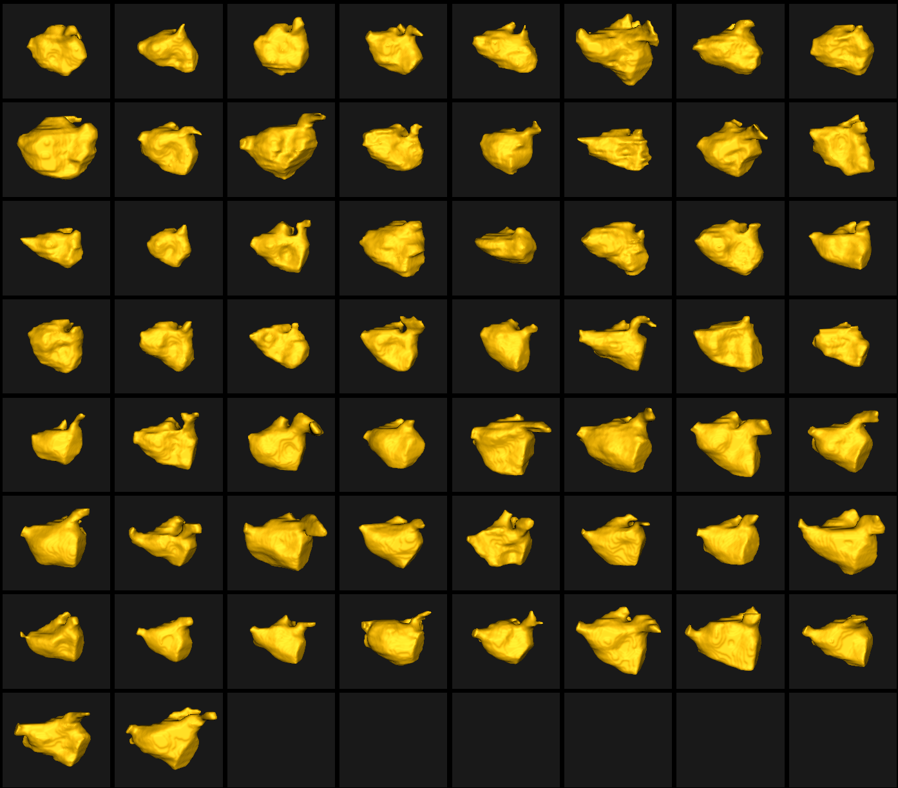

# Left Atrium: Shape Model from Segmentations

## What is the Use Case? 


The `left_atrium` use case demonstrates using ShapeWorks tools to perform the following.

- Build a shape model where shapes are given as binary segmentations
- Groom a dataset that contains both shapes (segmentations) and their corresponding imaging data (e.g., MRI) (when `--groom_images` tag is used)
- Showcase both single-scale and multi-scale optimization for particles optimization

## Grooming Steps

The grooming stage entails rigid transformations to align samples for groupwise modeling and analysis. It also changes the origin, voxel size, image size, orientation, etc. of the shape data. Grooming can be done with imaging data (CT/MRI) so that it is carried through each grooming step and with the shapes so that is remains in alignemtn and can be used for subsequent analysis. Here are the grooming steps:

1. **Isotropic Resampling**: Both binary segmentations in `left_atrium/segmentations/` and their corresponding images in `left_atrium/images/` are resampled to have an isotropic voxel spacing.
2. **Centering**: Segmenations and images are translated to have an origin at (0,0,0).
3. **Apply Padding**: Segmentations that touch the image boundary will have an artificial hole at that intersection. Segmentations and images are padded by adding a user-defined number of voxels along each image direction (rows, cols, and slices) to avoid introducing artificial holes.
4. **Center-of-Mass Alignment**: This translational alignment step is performed before rigidly aligning the samples to a shape reference. This factors out translations to reduce the risk of misalignment and allow for a medoid sample to be automatically selected as the reference for rigid alignment.
5. **Reference Selection**: The reference is selected by first computing the mean (average) distance transform of the segmentations, then selecting the sample closest to that mean (i.e., medoid).
6. **Rigid Alignment**: All of the segmentations and images are then aligned to the selected reference using rigid alignment, which factors out the rotation and remaining translation. The alignment parameters are computed based on aligning segmentations and then applied to their corresponding images.
7. **Bounding Box**: The smallest region which fits all of the samples is found.
8. **Cropping**: The segmentations are cropped to the size of the bounding box.
9. **Distance Transform**: Finally, the signed distance transform is computed, and the dataset is now ready for the optimize phase.

Here are the resulting groomed ditsance transforms:



## Supported Tags

``` 
        --use_subsample --num_subsample --groom_images --skip_grooming --use_single_scale --mesh_mode --tiny_test
``` 
## Optimization Parameters

Below are the default optimization parameters when running this use case.
```
    "number_of_particles" : 512, 
    "use_normals": 0,
    "normal_weight": 10.0,
    "checkpointing_interval" : 200,
    "keep_checkpoints" : 0,
    "iterations_per_split" : 4000,
    "optimization_iterations" : 4000,
    "starting_regularization" : 1000,
    "ending_regularization" : 10,
    "recompute_regularization_interval" : 2,
    "domains_per_shape" : 1,
    "relative_weighting" : 10,
    "initial_relative_weighting" : 0.1,
    "procrustes_interval" : 1,
    "procrustes_scaling" : 1,
    "save_init_splits" : 0,
    "verbosity" : 3,
    "use_shape_statistics_after": 128
```
## Analyzing Shape Model

### Single-Scale Optimization

Here is the mean shape of the optimized shape mode using single-scale optimization.


Here is a video showing the shape modes of variation (computed using principal component analysis - PCA) of the left atrium dataset using single-scale optimization.
<p><video src="https://sci.utah.edu/~shapeworks/doc-resources/mp4s/leftatrium_singlescale_pca.mp4" autoplay muted loop controls style="width:100%"></p>


### Multi-Scale Optimization

Here is the mean shape of the optimized shape mode using multi-scale optimization.
     


Here is a video showing the shape modes of variation (computed using principal component analysis - PCA) of the left atrium dataset using multi-scale optimization.

<p><video src="https://sci.utah.edu/~shapeworks/doc-resources/mp4s/leftatrium_multiscale_pca.mp4" autoplay muted loop controls style="width:100%"></p>
