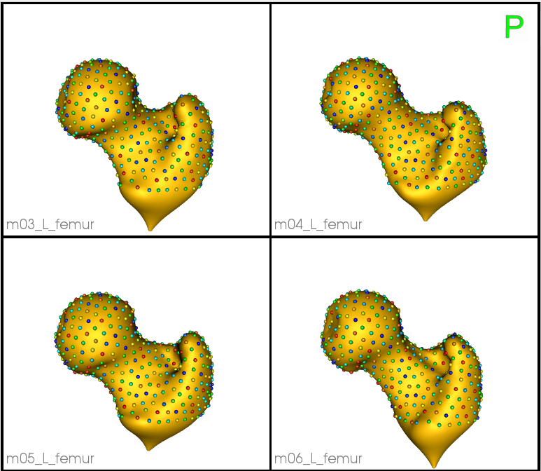

# Femur: SSM from Segmentations

## What is the Use Case?

The `femur` use case demonstrates using ShapeWorks tools to perform the following.

- Build a shape model where shapes are given as triangular surface meshes
- Groom a dataset that contains both shapes (meshes) and their corresponding imaging data (e.g., CT) when `--groom_images` tag is used.

The femur meshes in this data set have been segmented with various shaft lengths, as can be seen below. To remove this variability so that it is not captured in the shape model, the femurs are clipped using a cutting plane. The use case has a pre-defined cutting plane.


!!! important 
    Minimum of 32GB of RAM required to run the full use case.

## Grooming Steps

We start with full unsegmented images (CT scans) of each femur's hip and segmented meshes in this use case. The surface meshes are first converted to image-based representation (i.e., binary segmentations). Each step's results are shown for the meshes (note every step is performed on both the meshes the images, although the resulting images are not shown here). 

1. **Reflect Meshes**: In this use case, we often have both right and left femur surface meshes. To align all the femurs, we choose one side to reflect both the image and mesh.
2. **Meshes to Volumes**: Meshes must be turned into binary volumes using rasterization. The corresponding image origin, size, and spacing are used to generate the volume. 
3. **Isotropic Resampling**: Both the image and rasterized segmentations are resampled to have an isotropic voxel spacing using a user-defined spacing. This step could also produce segmentations with smaller voxel spacing, thereby reducing aliasing artifacts (i.e., staircase/jagged surface) due to binarization. 
4. **Apply Padding**: Segmentations that touch the image boundary will have an artificial hole at that intersection. Segmentations are padded by adding a user-defined number of voxels along each image direction (rows, cols, and slices) to avoid introducing artificial holes.
5. **Center of Mass Alignment**: This translational alignment step is performed before rigidly aligning the samples to a shape reference. This factors out translations to reduce the risk of misalignment and allow for a medoid sample to be automatically selected as the reference for rigid alignment. 
6. **Reference Selection**: The reference is selected by first computing the mean (average) distance transform of the segmentations, then selecting the sample closest to that mean (i.e., medoid).
7. **Rigid Alignment**: All of the segmentations and images are then aligned to the selected reference using rigid alignment, which factors out the rotation and remaining translation. The alignment parameters are computed based on aligning segmentations and then applied to their corresponding images. The samples must be centered before they are aligned to a reference. This step can be performed with Isotropic Resampling as it is in the left atrium use case. In the Femur use case, we do so separately so that we can get the translation and apply it to the cutting plane if it has already been selected.
8. **Clip Segmentations**: Because the femur segmentations vary in shaft lengths, we use the defined cutting plane to clip them, so only the region of interest remains.
9. **Cropping**: The images and segmentations are cropped so that all of the samples are within the same bounding box. The bounding box parameters are computed based on the smallest bounding box that encapsulates all the given dataset segmentations.
10. **Distance Transform**: Finally, the signed distance transform is computed, and the dataset is now ready for the optimize phase.


## Supported Tags

``` 
        --use_subsample --num_subsample --groom_images --skip_grooming --use_single_scale --mesh_mode --tiny_test
``` 
## Optimization Parameters

```
        "number_of_particles" : 1024,
        "use_normals": 0,
        "normal_weight": 10.0,
        "checkpointing_interval" : 200,
        "keep_checkpoints" : 1,
        "iterations_per_split" : 4000,
        "optimization_iterations" : 4000,
        "starting_regularization" : 100,
        "ending_regularization" : 0.1,
        "recompute_regularization_interval" : 2,
        "domains_per_shape" : 1,
        "domain_type" : 'image',
        "relative_weighting" : 10,
        "initial_relative_weighting" : 1,
        "procrustes_interval" : 1,
        "procrustes_scaling" : 1,
        "save_init_splits" : 1,
        "verbosity" : 2,
        "use_statistics_in_init" : 0
        "use_shape_statistics_after": 64 
```

## Analyzing Shape Model
Here is the mean shape of the optimized shape mode using single-scale optimization.

<p><video src="https://sci.utah.edu/~shapeworks/doc-resources/mp4s/femur_mean.mp4" autoplay muted loop controls style="width:100%"></p>

Here are femur samples with their optimized correspondences.


Zooming in some femur samples.


Here is a video showing the shape modes of variation (computed using principal component analysis - PCA) of the femur dataset using single-scale optimization.

<p><video src="https://sci.utah.edu/~shapeworks/doc-resources/mp4s/femur_pca.mp4" autoplay muted loop controls style="width:100%"></p>
