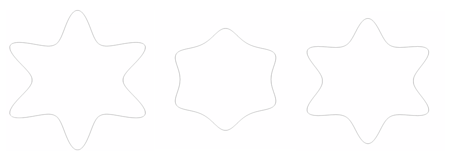

# Shape Model for Contour Domains

## What and Where is the Use Case?

This use case demonstrates using ShapeWorks tools to perform the following.
- Optimization for N-dimensional contours

The use case is located at: `Examples/Python/supershapes_1mode_contour.py`

Here is an example of the data:


## Running the Use Case

To run the use case, run `RunUseCase.py` (in `Examples/Python/`).

```
$ cd /path/to/shapeworks/Examples/Python
$ python RunUseCase.py --use_case supershapes_1mode_contour
```

This calls `supershapes_1mode_contour.py` (in `Examples/Python/`) to perform the following.
 

* Loads the `supershapes_1mode_contour` dataset using a local version if it exists (i.e., previously downloaded); otherwise, the dataset is automatically downloaded from the [ShapeWorks Data Portal](http://cibc1.sci.utah.edu:8080/).
* Optimizes particle distribution (i.e., the shape/correspondence model) by calling optimization functions in `OptimizeUtils.py` (in `Examples/Python/`). See [Optimizing Shape Model](#optimizing-shape-model) for details about algorithmic parameters for optimizing the shape model.
* Launches ShapeWorks Studio to visualize the use case results (i.e., the optimized shape model and the groomed data) by calling functions in `AnalyzeUtils.py` (in `Examples/Python/`).


## Grooming Data

In this use case, we download pre-groomed data.

## Optimizing Shape Model

Below are the default optimization parameters when running this use case. For a description of the optimize tool and its algorithmic parameters, see: [How to Optimize Your Shape Model](../workflow/optimize.md).


```python
{
        "number_of_particles" : 64,
        "use_normals": 0,
        "normal_weight": 0.0,
        "checkpointing_interval" : 5000,
        "keep_checkpoints" : 0,
        "iterations_per_split" : 100,
        "optimization_iterations" : 500,
        "starting_regularization" : 100,
        "ending_regularization" : 1,
        "recompute_regularization_interval" : 1,
        "domains_per_shape" : 1,
        "domain_type" : 'contour',
        "relative_weighting" : 5,
        "initial_relative_weighting" : 0.1,
        "procrustes_interval" : 2,
        "procrustes_scaling" : 0,
        "save_init_splits" : 0,
        "verbosity" : 3,
        "use_shape_statistics_after": 4,
}
```

## Analyzing Shape Model

ShapeWorks Studio visualizes/analyzes the optimized particle-based shape model by visualizing the mean shape, individual shape samples, and the shape modes of variations. For more information, see: [How to Analyze Your Shape Model?](../workflow/analyze.md).            

